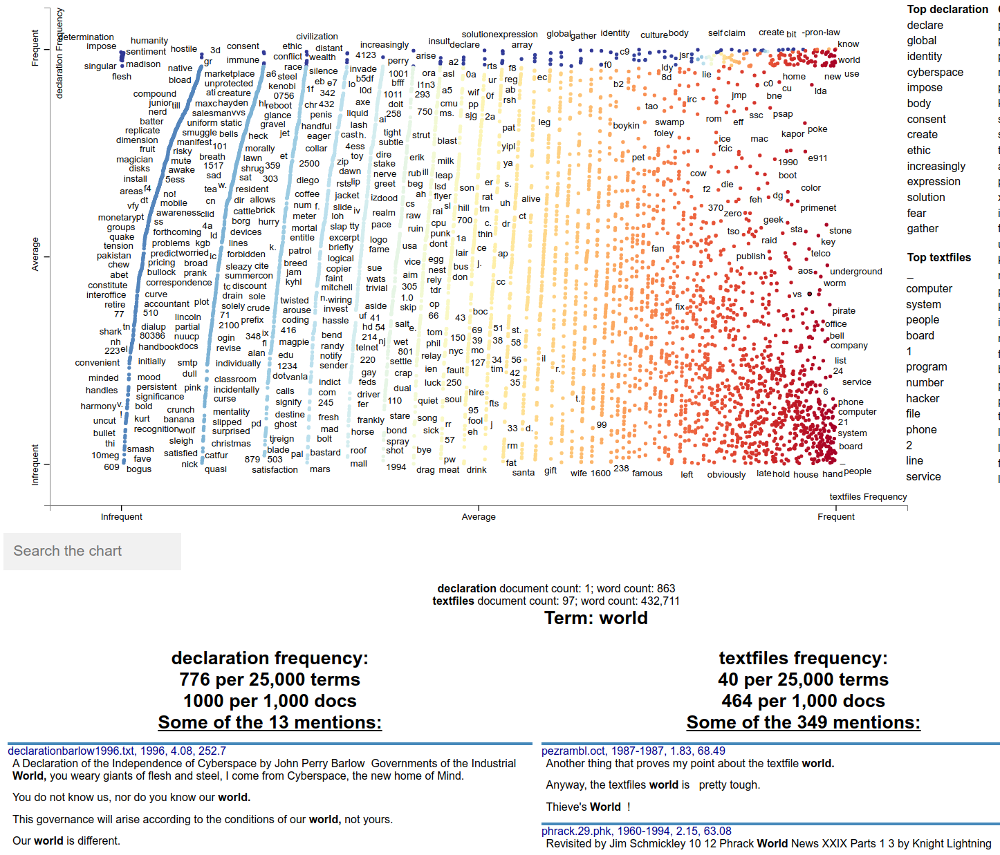
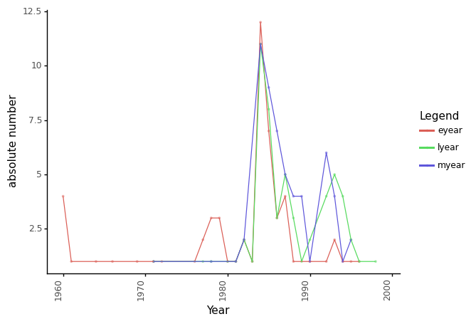

\input{latex/header.tex}

# Einleitung

In den frühen Jahren des Internets war der Informationsaustausch und die Kommunikation nicht gleich einfach gestaltet wie heute. Trotzdem wurde in der Vernetzung ein grosses Potential erkannt und techno-utopische Communities entstanden. Ein Mittel zum Austausch waren Bulletin Board Systeme (BBS), Server auf denen jede und jeder mit Zugriff zu einem am Telefonnetz angeschlossenen Computer, Texte hoch- und herunterladen konnten.[^1] Jason Scott[^2] unterhält ein Archiv mit einem Umfang von 58'000 solcher Text-Dateien.

Als Vorbereitung für die Hauptseminararbeit (HSA)[^3], in welcher dieses Archiv zur Beantwortung der Frage nach dem Einfluss der BBS auf die 1996 formulierte «Declaration of the Independence of Cyberspace»[^4] dienen soll, wird in diesem Mini-Projekt[^5] der verkleinerte Datensatz «favorite 100» untersucht. Konkret soll geprüft werden, ob inhaltliche Auffälligkeiten bestehen, die möglicherweise Rückschlüsse auf Scotts Interessen und seine Biografie zulassen. Dieses Mini-Projekt soll ebenfalls zur Einschätzung dienen, wie aufwändig die Bereinigung des gesamten Textkorpuses ($N=58'0000$ Dateien) sein wird.

# Methode

Im ersten Schritt sollen die Dateien manuell untersucht und dabei Auffälligkeiten zu Jahr, Länge, Struktur und Inhalt festgehalten werden. Diese Beobachtungen fliessen in das Kapitel *Datensatz* ein und dienen der anschliessenden maschinellen Aufbereitung der Textdateien zur Verwendung als Korpus. Einige grobe Analysen werden ausgeführt um den Textkorpus zu testen. Die Erkenntnisse werden im Fazit zusammengefasst.

# Datensatz

Untersuchungsgegenstand dieses Projekts ist der Datensatz «Jason Scott's Top 100 Textfiles» (aufrufbar unter: [http://textfiles.com/100/](http://textfiles.com/100/)). Dieser Datensatz stellt «a ‹best of› collection of one hundred textfiles that [Scott] think[s] capture the spirit of this site and the unique culture that it attempts to preserve» dar [@jasonscottJasonScottTop].

Die Dateien werden mittels Python heruntergeladen und bereitgestellt (R2[^6]) und anschliessend ein Datensatz mit den Dateinamen, Längen und Inhalt erstellt (R3.1.1). Die manuelle Untersuchung des Datensatzes (Anhang 1) zeigt:

* Die **Variation** der Textdateien ist relativ gross und reicht von kurzen witzigen Beiträgen und Unterhaltungsverläufen, über ASCII Art bis hin zu detaillierten technischen Instruktionen und Dokumentationen sowie einer Masterarbeit und einem ganzes Buch.
* In gewissen Textdateien wird ein **«Read X times»** ausgewiesen. Diese Zahlen sind relativ niedrig (meist <100). 
* **Ungültige Zeichen** kommen häufig vor (z.B. «\\u1a\\u1a\\u1a»). Diese müssen gefiltert werden (bereits in Datenimport sprich DataWrangler.get_texts() implementiert).
* Textfiles.com führt nebst den Dateien auch Titel (inkl. Jahr wenn vorhanden) und Kategorisierung sowie zum Teil eine Beschreibung auf. Diese **Metadaten** können für die Analyse nützlich sein.
* Textdateien mit E-Mail Charakteristik können anhand **Headerparameter** wie z.B. *From, Subject, Date, Organization* erkannt werden.
* Folgende **Datumsformate** sind zu finden: «1991», «1/8/86», «02/25/88», «Copyright 1993 by», «(n)o copyright!, 1985», «8-25-86», «17 March 1981 13:59 est», «updated 2-12-92», «Date: 1 Mar 89 11:30:05 GMT», «August 2nd 1985», «b-file#1 nov. 1984», «(c) 1984-85 NPI/Appa Teleworks I», «Published       June, 1971»; Vorsicht ist mit Telefonnummern geboten, da diese teils ebenfalls zwei- und vierstellige Zahlen beinhalten (z.B. «(609)/921-1994»)
* Es kann nicht davon ausgegangen werden, dass die Textdateien **orthografisch** fehlerfrei sind. Ebenfalls ist mit ***Gunk** «(replacing U for You, 0 for O, Z for S, and similar gunk)»* zu rechnen.
* **Inhaltlich** kommt von sauber recherchierten Artikeln und Facts bis hin zu wilder Fiktion und Ironie alles vor. 
* Die beim Download von .zip Dateien enthaltene **index.html** kann für die Ermittlung von Metadaten nützlich sein, ansonsten soll diese nicht analysiert werden, da sie keine BBS Textdatei repräsentiert.

Anhand der manuellen Untersuchung konnten erste Erkenntnisse gewonnen werden, die im weiteren Verlauf dieses Projekts relevant sind, respektive für die HSA von Bedeutung sind:

* Die folgenden zehn Textdateien sollen für die HSA genauer betrachtet werden, um daran exemplarisch den Zusammenhang von BBS und der Declaration aufzuzeigen: *billrights.fun, cDc-0200.txt, crossbow, eel_bye.txt, hack_ths.txt, hack7.txt, iaad.txt, modemlif.hac, pezrambl.oct, tr823.txt*
* Der Textkorpus soll entsprechend bereinigt werden, dass vor allem Fliesstext in die Auswertung einfliesst. Auch sollen unterstützende Metadaten dafür generiert werden. Das Vorgehen wird wie folgt vorgeschlagen (in DataWrangler.get_texts() implementiert):
    * Bereinigung von ungültigen Zeichen (\\x1a)
    * Bereinigung von Zeichen die `[^A-z0-9\ \.\'\,\!]` oder `[\\\\\^\[\]]` sind
    * Bereinigung von Formatierungszeichen (\\r\\n, \\r, \\n, \\t)
    * Dateiname als Metadaten (name)
    * Zeichenanzahl (raw) als Metadaten (length_raw)
    * Zeichenanzahl (bereinigt) als Metadaten (length)
    * Durchschnittliche Spaltenbreite (raw) als Metadaten (avgcolumnsize)
    * Anteil von Fliesstext gegenüber Sonderzeichen (raw) als Metadaten (charratioA & charratioB)
    * Jahr des Textfiles (Annahme: zwischen 1960-1999) als Metadaten (year)

Zusätzlich zu den ausgewerteten Textdateien wird die Declaration of the Independence of Cyberspace in den Textkorpus aufgenommen, damit dieser schliesslich verglichen werden kann. In den Metadaten (type) wird vermerkt, ob es sich um ein Textfile oder um die Declaration handelt.

# Results

Mittels Textacy wird aus den oben beschriebenen Daten ein Korpus erstellt (R3.2). Anschliessend wird ein entsprechender Subkorpus generiert, da sich noch unerwünschte Dateien im Korpus befinden (R3.3).

Anschliessend werden folgende Auswertungen durchgeführt:

## Wordcount (R3.4)

Hier ist auffällig, dass einschlägige (IT) Begriffe prominent vertreten sind. Beispiele dafür sind: *computer, system, phone, program, software, bbs*. Allerdings sind auch Begriffe auffällig die auf eine «Bewegung» hindeuten: *people, time, new, real, service, information, hackers*.

## Scattertext Plot (R3.7)

Die interaktive Analyse[^7] zeigt, dass zwischen der Declaration und den Textfiles kein deutlicher Trend zu erkennen ist. Die Top Begriffe der Textfiles sind in der Declaration nicht vorhanden. Dem gegenüber sind die Top Begriffe der Declaration zum Teil in den Textfiles enthalten. Gesamthaft betrachtet macht aber eine Suche nach den Begriffen der Declaration innerhalb des Textkorpus nur beschränkt Sinn.

## Textfiles pro Jahr (R3.8)

Diese Auswertung überprüft, wie akkurat die gewählte Identifikation des Ursprungsjahres eines Textfiles ist. Die manuelle Identifikation des Jahres (myear) stellt den Referenzwert dar. Das älteste respektive frühst genanntes Jahr (eyear = earliest year) ist ungenauer ($r = 0.77$) als das jüngste respektive neuste genannte Jahr (lyear = latest year) ($r = 0.91$).

## Entitäten (R3.9)

Die Entitäten enthalten mit aktuellem Stand der Auswertung noch Fehler in sieben Textfiles und gesamt betrachtet relativ viel Müll. Trotzdem ist auffällig, dass die Entitäten *IBM* und *Bell* in den Top 25 auftauchen. Dies kann damit erklärt werden, dass IBM sowie Bell relevante Unternehmen für BBS sind. Daran anzuschliessen wäre *Apple*, die aber nicht in der Auflistung vorkommt. Ebenfalls fallen die Namen *Kapor* und *Neidorf* auf, beide Prominente Akteure in der BSS- und Hacker-Bewegung. *Barlow* wäre hier zusätzlich zu erwarten gewesen. Allerdings werden die Resultate durch das Textfile *hack11a.txt* stark beeinflusst.

# Fazit

Durch diese erste Analyse der Top 100 Textfiles von Jason Scott kann ein gewisser Trend festgestellt werden. Dieser Trend (IT und Hacking-Themen) können durchaus mit Scotts Interessen und seiner Biografie in Verbindung gebracht werden. Fast wichtiger sind aber folgende Punkte, die als erste Erkenntnisse zur Machbarkeit der HSA dienen:

* Das Jahr konnte bei den Top 100 Textfiles mit einer Genauigkeit von rund 90% ($r = 0.91$), verglichen mit der manuellen Überprüfung, bestimmt werden. Allerdings ist bei 40% der Textfiles auch manuell keine Bestimmung des Jahres möglich. Dies kann sich als Problem äussern, wenn zeitliche Veränderungen bestimmt werden sollen. → Die Erhöhung der Bestimmung des Jahres muss angestrebt werden. Ein weiterer Schritt zur Verbesserung der *Jahreszahlenausbeute* könnte Web Scraping sein.
* Die Berechnung der Korpora (R3.2 → 1:20min) und Auswertungen (R3.7 → 1:00min) dauerte bei den 100 Textfiles rund 2:30min. Dabei wird der Arbeitsspeicher (16GB) vollständig ausgelastet. Eine genauere Überprüfung des Flaschenhalses muss durchgeführt werden, damit eine adäquate Arbeitsumgebung zur Berechnung aller 58'000 Textfiles bereitgestellt werden kann. Auch Code Optimization und Ermöglichung von Multicore-Processing (oder GPU-Processing) muss eingeplant werden. Ebenfalls kann eine geschickte Filterung die Menge an Dateien, die ausgewertet werden müssen, reduziert werden.
* Die Bereinigung der Textfiles erscheint mit der hier gewählten Methode zu funktionieren. Diese soll aber noch verfeinert und genauer geprüft werden.
* Eine manuelle Überprüfung der Textfiles ist sehr zeitaufwändig. Für einen grösseren Textkorpus erscheint das als unrealistisch im Rahmen der HSA zu bewältigen. Die maschinelle Verarbeitung ist somit essentiell.
* Die Arbeit mit den Textfiles ist unglaublich spannend und macht Spass! Die Kombination von Nostalgie, *Geekheit* und Hacking lässt vergessen, welche Tageszeit es ist.

# Anhang

## Anhang 1: Manuelle Untersuchung

Die Ergebnisse der manuellen Untersuchung wurden in einer Tabelle zusammengetragen. Es kann heruntergeladen werden unter: [https://git.makersphere.ch/josias/jason-scotts-favorite-100/raw/master/workspace/top100.ods](https://git.makersphere.ch/josias/jason-scotts-favorite-100/raw/master/workspace/top100.ods)

## Anhang 2: Präsentation

Unter folgendem Link ist eine Aufzeichnung (vom 27.05.2021) der Präsentation zum Mini-Projekt verfügbar:

[https://ipfs.chixodo.xyz/ipfs/QmddarVDZ6tbJZChUiiKQZw4y3kG8MPrwJJc4YhrjcGgMX](https://ipfs.chixodo.xyz/ipfs/QmddarVDZ6tbJZChUiiKQZw4y3kG8MPrwJJc4YhrjcGgMX)

# Quellen

[^1]: Die Funktionen solcher BBS waren weitreichender. Für die in dieser Arbeit geplante Untersuchung stellt diese Funktion allerdings die wichtigste dar.
[^2]: Amerikanischer Archivar, Historiker und Betreiber von textfiles.com sowie Mitwirkender bei archive.org.
[^3]: Das Exposé ist verfügbar unter dem folgenden Link: [https://git.makersphere.ch/josias/jason-scotts-favorite-100/raw/master/Expose_HSA.pdf](https://git.makersphere.ch/josias/jason-scotts-favorite-100/raw/master/Expose_HSA.pdf)
[^4]: Verfasst von der Electronic Frontier Foundation (EFF)
[^5]: Der Sourcecode ist verfügbar im Repository unter: [https://git.makersphere.ch/josias/jason-scotts-favorite-100/tree/master/workspace](https://git.makersphere.ch/josias/jason-scotts-favorite-100/tree/master/workspace)
[^6]: Verweis zu entsprechenden Abschnitten in der Code-Dokumentation: [https://git.makersphere.ch/josias/jason-scotts-favorite-100/raw/master/public/workspace.html](https://git.makersphere.ch/josias/jason-scotts-favorite-100/raw/master/public/workspace.html)
[^7]: Zu finden unter: [https://git.makersphere.ch/josias/jason-scotts-favorite-100/raw/master/public/viz_declaration_textfiles.html](https://git.makersphere.ch/josias/jason-scotts-favorite-100/raw/master/public/viz_declaration_textfiles.html)